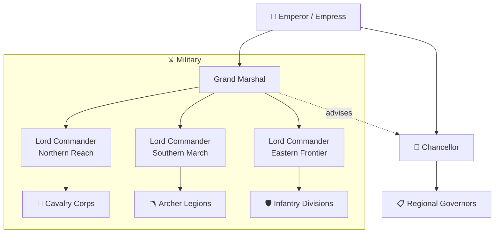

```mermaid
graph TD
  A["👑 Emperor / Empress"]
  D["📜 Chancellor"]
  H["📋 Regional Governors"]

  subgraph MIL["⚔️ Military"]
    C["Grand Marshal"]
    G1["Lord Commander\nNorthern Reach"]
    G2["Lord Commander\nSouthern March"]
    G3["Lord Commander\nEastern Frontier"]
    K["🏇 Cavalry Corps"]
    L["🪃 Archer Legions"]
    M["🛡 Infantry Divisions"]
    C --> G1
    C --> G2
    C --> G3
    G1 --> K
    G2 --> L
    G3 --> M
  end

  A --> C
  A --> D
  C -. advises .-> D
  D --> H
```
