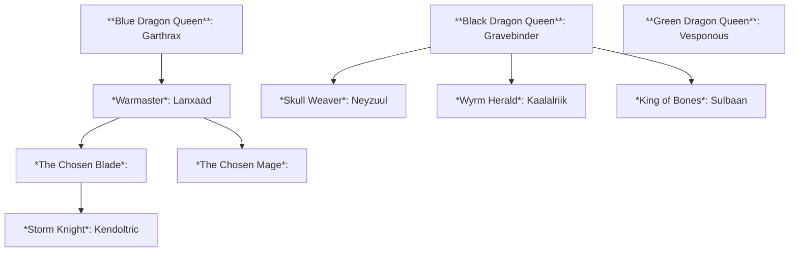

---

The Triumvirate Scales are ruled by tyrannical and highly powerful dragons, as a result the only true form of law is their will. In order to maintain their lands in their desired manner they appoint followers to govern and positions of importance. Below are the 3 bodies of 'Government', divided by the dragon they serve.

## The Azure Court

The selected and honored warrior and military followers of the Blue Dragon [[Garthrax]].

- **The Superior**: 
	- *Warmaster*: [[Lanxaad]]
- **The Elite**: 
	- The Chosen Blade: 
	- The Chosen Mage: 
- **The Honored**: 
	- Stom Knight: [[Terra-Nova/Characters/People/Kendoltric]]
	- 

---

## The Risen Court

The greatest and most powerful undead followers of the Black Dragon [[Gravebinder]]. 

- **The Lich Council**: A group of powerful Liches who advise and assist Gravebinder in magic and necromantic study. The Lich Council are raised personally by Gravebinder, who grants them a portion of his necromantic power, allowing them to raise and control undead of their own, who also answer to Gravebinder. Undead raised by the Lich Council are linked to them, and possess no minds of their own. The weaker undead have no personality, but generally they are fully possessed and act as extra bodies for their masters, transferring their senses and able to be spoken through by their masters, similar to a simulacrum.
	- *Skull Weaver*: [[Neyzuul]] 
	- *Wyrm Herald*: [[Kaalalriik]] 
	- *King of Bones*: [[Sulbaan]] 
- **The Deathsingers**: A trio of powerful mages who employ a necromantic melody known as 'The Deathsong' to kill and raise their foes as thralls. The Deathsong is considered to be the ultimate killing magic, and once it is completed and heard by an enemy they do not die, but cease to live entirely. After death their life force and magical power are added to the power of the Deathsong, making it stronger each time it kills. Great weapons known as 'Grave Instruments' are created using the Deathsong's killing power.
	- *The First Singer*: Halde
	- *The Second Singer*: 
	- *The Third Singer*: 
- 

---

## The Spiteful Court

The fervent and loyal worshippers of the Green Dragon [[Vesponous]]. 

- **The Sarin Witches**: 
	- tbd
- **The Bloodfir Druids**:
	- tbd
- **The Goblin Kings**: 
	- *King of Boils*: [[Mutalis]]
	- 

---

## Wyrm-Chosen

The Wyrm-Chosen are unique champions of the Triumvirate Scales who are not beholden to a single dragon, but all 3. There is only one at any given time, and were created to rival Divine Champions of the Gods, and further solidify the Dragon Lords as new Gods. They lead all armies of the Triumvirate, and have special privilages to use vavst amounts of power and freedom granted by their elevated position in the Triumvirate.

- **Past Wyrm-Chosen**:
	- 
- **Current Wyrm-Chosen**:
	- [[Aldros]]

