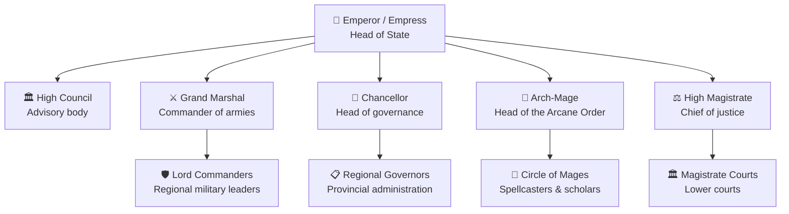

---

The Triumvirate Scales are ruled by tyrannical and highly powerful dragons, as a result the only true form of law is their will. In order to maintain their lands in their desired manner they appoint followers to govern and positions of importance. Below are the 3 bodies of 'Government', divided by the dragon they serve.

## The Azure Court

The selected and honored warrior and military followers of the Blue Dragon [[Garthrax]].

- **The Superior**: 
	- *Warmaster*: [[Lanxaad]]
- **The Elite**: 
	- bbb
- **The Honored**: 
	- bbb

---

## The Risen Court

The greatest and most powerful undead followers of the Black Dragon [[Gravebinder]]. 

- **The Lich Court**: A group of powerful Liches who advise and assist Gravebinder in magic and necromantic study.
	- bbb
- **The Deathsingers**:
	- bbb
- 

---

## The Spiteful Court

The fervent and loyal worshippers of the Green Dragon [[Vesponous]]. 

- **The Sarin Witches**: 
	- bbb