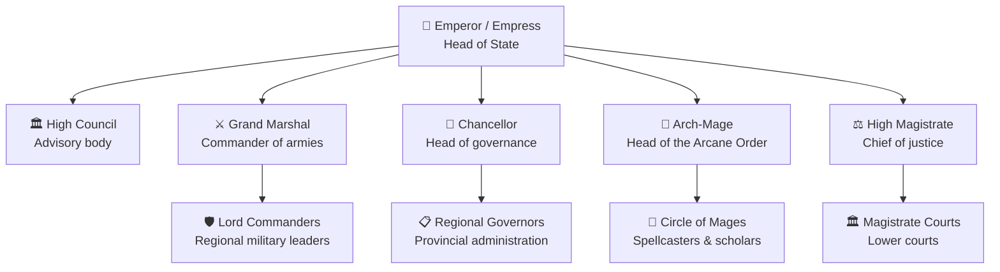

```mermaid
graph TD
  A["👑 Emperor / Empress\nHead of State"]
  B["🏛 High Council\nAdvisory body"]
  C["⚔️ Grand Marshal\nCommander of armies"]
  D["📜 Chancellor\nHead of governance"]
  E["🔮 Arch-Mage\nHead of the Arcane Order"]
  F["⚖️ High Magistrate\nChief of justice"]
  G["🛡 Lord Commanders\nRegional military leaders"]
  H["📋 Regional Governors\nProvincial administration"]
  I["🔭 Circle of Mages\nSpellcasters & scholars"]
  J["🏛 Magistrate Courts\nLower courts"]

  A --> B
  A --> C
  A --> D
  A --> E
  A --> F
  C --> G
  D --> H
  E --> I
  F --> J
```
